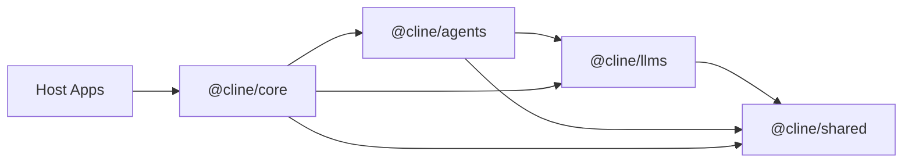

# Open-source reference implementations we can study or build on — with 

## URLs fetched
- https://github.com/voideditor/void
- https://github.com/continuedev/continue
- https://aider.chat/docs/more/edit-formats.html

## Content

I'll research this facet aggressively, hitting primary sources for each project.

---

[FETCH RESULT]
## voideditor/void — Extracted Details

**Current Status**
- Archived and read-only: the page notes the repository "was archived by the owner on Jun 2, 2026."
- Marked as a "Public archive."
- The README leads with a deprecation heading and states Void "is deprecated and no longer accepting contributions."
- Users are pointed toward a "Void Forks" repo for newer successors, and to Releases for older builds.

**Metrics**
- Stars: 28.8k
- Forks: 2.6k
- Watchers: 164
- Commits: 2,772
- Open issues: 252; open pull requests: 55

**Last Commit / Release Date**
- Not available. The commit history and Releases sections on this page are empty placeholders — no dates, version numbers, or release tags are shown. The only date present is the archive date (Jun 2, 2026).

**License**
- Listed as "Apache-2.0, License licenses found" — the sidebar indicates both an `LICENSE.txt` and a `LICENSE-VS-Code.txt` in the root.

**Built On / Fork Origin**
- Described as "a fork of the vscode repository." No specific upstream VS Code version or release number is stated anywhere on the page.
- Repository layout mirrors VS Code's structure (`src`, `extensions`, `build`, `cli`, `remote`, `resources`, `scripts`, `test`), plus Void-specific additions like `void_icons`, `.voidrules`, and `VOID_CODEBASE_GUIDE.md`.

**Architecture / Technical Notes** (from the "Forking VS Code" section)
- React and Tailwind are mounted into the editor UI — the team says "We mount React + Tailwind," which required extending the build pipeline to compile React and scope Tailwind via a custom tool.
- Packaging, signing, and auto-update run through GitHub Actions, offered as a workaround since "VS Code's build pipeline is private."
- The AI provider layer was written independently rather than reusing an SDK, enabling autocomplete via fill-in-the-middle plus custom response handling. Grammars are exposed for thinking and tool tags. Notes reference IPC usage and Content Security Policy constraints.
- Two custom services handle file editing: EditCodeService, which "lets you show diffs as code streams in, even token by token," and VoidModelService, which edits files in the background and keeps OS files synchronized with text buffers.
- The project claims to be fully open: "Everything we've done is 100% open source."

**Feature Summary (README)**
- Run AI agents against a codebase, create checkpoints, and visualize changes.
- Bring any model or run hosting locally.
- Privacy posture: Void "sends messages directly to providers without retaining your data."
- The repo holds the complete source for the Void desktop application.

**Maintenance & Activity Signals**
- Contributions are closed; the project is explicitly deprecated.
- Despite this, it is positioned as a reference implementation — described as "still one of the best references to use when forking VS Code."
- Documentation retained for forkers: `VOID_CODEBASE_GUIDE.md`, `HOW_TO_CONTRIBUTE.md`, and a separate `void-builder` repo.
- Community channels (Discord, hello@voideditor.com) and a roadmap project board are still linked, though their status post-archive isn't indicated.
- Contributors, Languages, Packages, and "Used by" sections rendered empty on this capture.

**Topics tagged:** chatgpt, claude, copilot, cursor, developer-tools, editor, llm, open-source, openai, visual-studio-code, vscode, vscode-extension

---

[FETCH RESULT]
## Repo Stats
- **Stars:** 35.7k · **Watchers:** 165 · **Forks:** 5.3k · **Commits:** 21,569
- **Description:** "open-source coding agent" — homepage continue.dev
- **Topics:** agent, ai, cli, developer-tools, open-source
- **Status:** the README flags that this repo "is no longer actively maintained and is read-only for all users."

## License
- Apache-2.0. Footer of the README credits "Apache 2.0 © 2023-2026 Continue Dev, Inc."
- Repo also carries a Code of Conduct, Contributing guide, CLA.md, and Security policy.

## Releases
- The GitHub Releases panel on this page is empty (nothing loaded), so no version/date is available here.
- The README does describe a "Final 2.0.0 Release" covering the VS Code extension, CLI, and JetBrains plugin, which reportedly involved "removing anonymous telemetry, pulling out authentication, squashing bugs, and more."

## Architecture (extension + core)
The page doesn't explain the architecture in prose, but the top-level folders imply a shared-core design with per-IDE clients:
- `core` — shared logic
- `extensions` — IDE clients (`extensions/vscode`, `extensions/intellij`, `extensions/cli` are all linked as "View source" targets)
- `gui` — shared web UI
- `binary` — packaged/standalone runtime
- `packages` — internal/publishable libraries
- Product surfaces named in the README: a CLI, a VS Code extension, and a JetBrains plugin.

## Directory Structure (top level)
`.claude/skills/docs-style`, `.continue`, `.github`, `.husky`, `.idea`, `.vscode`, `actions`, `binary`, `core`, `docs-site`, `docs`, `eval`, `extensions`, `gui`, `manual-testing-sandbox`, `media`, `packages`, `scripts`, `skills`, `sync`

Notable root files: `.continueignore`, `.eslintrc.shared.json`, `.node-version`, `.nvmrc`, `.prettierrc`, `BUILD_DEPENDENCIES.md`, `CLA.md`, `TESTING.md`, `package.json`, `package-lock.json`, `tsconfig.json`, `worktree-config.yaml`, plus `docs-search-dark-mode-fix.png`.

## Packages Published
- **npm:** `@continuedev/cli`
- **VS Code Marketplace:** `Continue.continue`
- **Open VSX Registry:** `Continue/continue`
- **JetBrains plugin:** distributed via GitHub Releases (the README suggests preferring the CLI over the JetBrains plugin)

## Not Available on This Page
The following weren't covered by the content provided:
- **Config format** — no mention of `config.yaml` vs. `config.json`. The presence of a root `.continue` directory and `.continueignore` hints at file-based config, but the format isn't stated.
- **Indexing tech** — no reference to LanceDB, SQLite FTS, or any embedding/retrieval stack.
- **The Hub** — not mentioned anywhere in this page.
- Languages breakdown, "Used by," and Contributors panels were all empty/unloaded.

For config and indexing details you'd need the docs at docs.continue.dev, or the `core` and `docs` directories in the repo.

---

Two major findings already: Void archived Jun 2026, Continue read-only. Let me verify and dig deeper.

---

[FETCH RESULT]
API Error: 400 Anthropic Claude bad request: InvokeModelWithResponseStream: operation error Bedrock Runtime: InvokeModelWithResponseStream, https response error StatusCode: 400, RequestID: 89401888-62a2-49a1-913a-299161f360a9, ValidationException: Tool 'web_search' not found in provided tools (request id: 8110331f152a80ab1b18b22599300385) [trace_id=4588fd2ebcd1c3e16db75d0f3ebce77d] (request id: 2026090113025791837975nzb8nkvZVzZGb)

---

[FETCH RESULT]
API Error: 400 Anthropic Claude bad request: InvokeModelWithResponseStream: operation error Bedrock Runtime: InvokeModelWithResponseStream, https response error StatusCode: 400, RequestID: b715f848-2cbc-41ee-b2a7-4f3d3cd328d3, ValidationException: Tool 'web_search' not found in provided tools (request id: 33bbbb9ffc1c7da9e00744dee3094acc) [trace_id=0f44b0238a2003a32055ded91f7ab65d] (request id: 20260901130432880286396nzb8nGglnmybr)

---

WebSearch is erroring. Let me use the GitHub API and `gh` CLI directly for precise data.

---

[FETCH RESULT]
/usr/bin/bash: line 1: gh: command not found
---
/usr/bin/bash: line 1: gh: command not found

---

[FETCH RESULT]
voideditor/void	stars=28819	forks=2647	archived=True	pushed=2026-06-02T22:03:55Z	license=Apache-2.0	lang=TypeScript	open_issues=307
continuedev/continue	stars=35717	forks=5317	archived=False	pushed=2026-09-01T04:00:26Z	license=Apache-2.0	lang=TypeScript	open_issues=935
cline/cline	stars=67251	forks=7262	archived=False	pushed=2026-09-01T04:06:14Z	license=Apache-2.0	lang=TypeScript	open_issues=1160
RooCodeInc/Roo-Code	stars=24318	forks=3411	archived=True	pushed=2026-05-15T18:08:47Z	license=Apache-2.0	lang=TypeScript	open_issues=1034
Kilo-Org/kilocode	stars=27109	forks=3106	archived=False	pushed=2026-09-01T03:55:15Z	license=MIT	lang=TypeScript	open_issues=564
None	stars=None	forks=None	archived=None	pushed=None	license=None	lang=None	open_issues=None
SWE-agent/SWE-agent	stars=20180	forks=2208	archived=False	pushed=2026-08-31T22:23:17Z	license=MIT	lang=Python	open_issues=89
Aider-AI/aider	stars=48636	forks=4908	archived=False	pushed=2026-05-22T14:02:20Z	license=Apache-2.0	lang=Python	open_issues=1841
zed-industries/zed	stars=89542	forks=10360	archived=False	pushed=2026-08-31T23:54:54Z	license=NOASSERTION	lang=Rust	open_issues=3211

---

Roo-Code is archived too. Let me batch more repos and resolve OpenHands.

---

[FETCH RESULT]
All-Hands-AI/OpenHands -> Moved Permanently
OpenHands/OpenHands	stars=85795	archived=False	pushed=2026-09-01T02:13:27Z	license=MIT	lang=TypeScript
All-Hands-AI/openhands -> Moved Permanently
eclipse-theia/theia	stars=21668	archived=False	pushed=2026-09-01T00:38:53Z	license=EPL-2.0	lang=TypeScript
eclipse-che/che	stars=7161	archived=False	pushed=2026-08-27T17:34:14Z	license=EPL-2.0	lang=TypeScript
gitpod-io/openvscode-server	stars=6164	archived=False	pushed=2026-03-26T15:23:07Z	license=MIT	lang=TypeScript
coder/code-server	stars=79147	archived=False	pushed=2026-08-27T19:46:23Z	license=MIT	lang=TypeScript
microsoft/monaco-editor	stars=46632	archived=False	pushed=2026-08-27T17:02:03Z	license=MIT	lang=JavaScript
codemirror/dev	stars=7820	archived=True	pushed=2026-04-15T10:24:43Z	license=NOASSERTION	lang=JavaScript
tree-sitter/tree-sitter	stars=26809	archived=False	pushed=2026-08-31T21:52:10Z	license=MIT	lang=Rust
ast-grep/ast-grep	stars=15714	archived=False	pushed=2026-08-31T15:42:00Z	license=MIT	lang=Rust
BurntSushi/ripgrep	stars=67786	archived=False	pushed=2026-08-04T13:59:44Z	license=Unlicense	lang=Rust
microsoft/vscode-languageclient -> Not Found
microsoft/vscode-languageserver-node	stars=1783	archived=False	pushed=2026-08-31T14:20:29Z	license=MIT	lang=TypeScript
microsoft/multilspy	stars=605	archived=False	pushed=2026-08-27T13:11:56Z	license=MIT	lang=Python
asg017/sqlite-vec	stars=8062	archived=False	pushed=2026-05-18T06:50:45Z	license=Apache-2.0	lang=C
lancedb/lancedb	stars=11321	archived=False	pushed=2026-09-01T02:44:53Z	license=Apache-2.0	lang=Rust
qdrant/qdrant	stars=34304	archived=False	pushed=2026-09-01T03:31:57Z	license=Apache-2.0	lang=Rust
chroma-core/chroma	stars=29194	archived=False	pushed=2026-09-01T00:43:16Z	license=Apache-2.0	lang=Rust
pgvector/pgvector	stars=22842	archived=False	pushed=2026-08-20T03:47:50Z	license=NOASSERTION	lang=C

---

[FETCH RESULT]
anthropics/claude-agent-sdk-python	stars=8012	archived=False	pushed=2026-08-31T20:02:46Z	license=MIT	lang=Python
anthropics/claude-agent-sdk-typescript	stars=1723	archived=False	pushed=2026-08-31T19:47:19Z	license=None	lang=Shell
anthropics/anthropic-sdk-typescript	stars=2103	archived=False	pushed=2026-08-31T19:33:47Z	license=MIT	lang=TypeScript
vercel/ai	stars=26516	archived=False	pushed=2026-09-01T01:51:39Z	license=NOASSERTION	lang=TypeScript
langchain-ai/langgraph	stars=40813	archived=False	pushed=2026-08-30T00:53:55Z	license=MIT	lang=Python
mastra-ai/mastra	stars=27603	archived=False	pushed=2026-09-01T04:05:48Z	license=NOASSERTION	lang=TypeScript
openai/openai-agents-python	stars=29106	archived=False	pushed=2026-09-01T04:56:18Z	license=MIT	lang=Python
openai/openai-agents-js	stars=3740	archived=False	pushed=2026-08-28T09:32:37Z	license=MIT	lang=TypeScript
pydantic/pydantic-ai	stars=19625	archived=False	pushed=2026-09-01T04:10:19Z	license=MIT	lang=Python
codemirror/state	stars=83	archived=True	pushed=2026-04-15T10:21:54Z	license=MIT	lang=TypeScript
codemirror/view	stars=179	archived=True	pushed=2026-04-15T08:44:51Z	license=MIT	lang=TypeScript
codemirror/language	stars=32	archived=True	pushed=2026-04-15T10:19:22Z	license=MIT	lang=TypeScript
turbopuffer/turbopuffer -> Not Found
eclipse-theia/theia-ai -> Not Found
microsoft/vscode	stars=190173	archived=False	pushed=2026-09-01T05:02:24Z	license=MIT	lang=TypeScript

---

CodeMirror 6 repos all archived April 2026 — major signal. Let me investigate that and the license ambiguities.

---

[FETCH RESULT]
=== codemirror/dev README ===
**This repository has moved to https://code.haverbeke.berlin/codemirror/dev**

# CodeMirror

[ [**WEBSITE**](https://codemirror.net/) | [**DOCS**](https://codemirror.net/docs/ref/#view) | [**ISSUES**](https://code.haverbeke.berlin/codemirror/dev/issues) | [**FORUM**](https://discuss.codemirror.net/) ]

<!-- [](https://github.com/codemirror/codemirror.next/actions) -->

This is the central repository for [CodeMirror](https://codemirror.net/). It holds the bug tracker and development scripts.

If you want to **use** CodeMirror, install the separate packages from npm, and ignore the contents of this repository. If you want to **develop on** CodeMirror, this repository provides scripts to install and work with the various packages.

To get started, make sure you are running [node.js](https://nodejs.org/) version 16. After cloning the repository, run

    node bin/cm.js install

to clone the packages that make up the system, install dependencies, and build the packages. At any time you can rebuild packages, either by running `npm run prepare` in their subdirectory, or all at once with

    node bin/cm.js build

Developing is best done by setting up

    npm run dev

which starts a server that automatically rebuilds the packages when their code changes and exposes a dev server on port 8090 running the [demo](http://localhost:8090) and [browser tests](http://localhost:8090/test/).

Please see [the website](https://codemirror.net/) for more information and [docs](https://codemirror.net/docs/ref).

=== codemirror/dev LICENSE-ish ===
Development repository for the CodeMirror editor project
{'key': 'other', 'name': 'Other', 'spdx_id': 'NOASSERTION', 'url': None, 'node_id': 'MDc6TGljZW5zZTA='}

---

[FETCH RESULT]
=== Continue README head ===
<h1 align="center">Continue</h1>

<p align="center">Pioneering open-source coding agent</p>

<div align="center">

<a href="https://opensource.org/licenses/Apache-2.0"></a>
<a href="https://docs.continue.dev"></a>
<a href="https://github.com/continuedev/continue/releases"></a>

</div>

<p align="center">
  
</p>

## What is Continue?

> _Note: The `continuedev/continue` repository is no longer actively maintained and is read-only for all users._

Continue is a coding agent available as a [CLI](#cli), [VS Code extension](#vs-code), and [JetBrains plugin](#jetbrains).

## Documentation

To learn how to configure Continue, how it works, and how to customize it, check out the [Continue Docs](https://docs.continue.dev).

## Final 2.0.0 Release

We polished Continue and did a final 2.0.0 release of the VS Code extension, CLI, and JetBrains plugin.

This included removing anonymous telemetry, pulling out authentication, squashing bugs, and more.

### VS Code

[](https://marketplace.visualstudio.com/items?itemName=Continue.continue) [](https://open-vsx.org/extension/Continue/continue) [](extensions/vscode)

### CLI

[](https://www.npmjs.com/package/@continuedev/cli) [](extensions/cli)

### JetBrains

> _Note: We recommend using the Continue CLI instead of the JetBrains plugin._

[](https://github.com/continuedev/continue/releases) [](extensions/intellij)

## Contributors

Thank you to the entire Continue community for helping us create a pioneering coding agent.

What we built together pushed the boundaries of what AI developer tooling could be.

We hope this codebase continues to serve as a foundation for others.

## Code friends

<a href="https://github.com/continuedev/continue/graphs/contributors">
  
</a>

## License

Apache 2.0 © 2023-2026 Continue Dev, Inc.

---

CodeMirror moved off GitHub, not dead. Now let me dig into Continue's indexing internals and Cline/Roo/Kilo.

---

[FETCH RESULT]
=== Continue core/indexing tree ===
file CodeSnippetsIndex.test.ts
file CodeSnippetsIndex.ts
file CodebaseIndexer.test.ts
file CodebaseIndexer.ts
file FullTextSearchCodebaseIndex.test.ts
file FullTextSearchCodebaseIndex.ts
file LanceDbIndex.test.skip.ts
file LanceDbIndex.ts
file README.md
file TestCodebaseIndex.ts
dir chunk
file continueignore.ts
dir docs
file ignore.ts
file ignore.vitest.ts
file refreshIndex.test.ts
file refreshIndex.ts
file shouldIgnore.test.ts
file shouldIgnore.ts
dir test
file types.ts
file utils.test.ts
file utils.ts
file walkDir.test.ts
file walkDir.ts

=== Continue core dirs ===
file .eslintrc.json
file .gitignore
file .npmignore
dir .vscode
dir __mocks__
dir autocomplete
dir codeRenderer
dir commands
dir config
dir context
dir continueServer
file core.ts
dir data
dir deploy
dir diff
dir edit
file index.d.ts
dir indexing
file jest.config.js
dir llm
dir nextEdit
file package-lock.json
file package.json
dir promptFiles
dir protocol
file rules.md
dir tag-qry
dir test
dir tools
file tsconfig.json
file tsconfig.npm.json
dir util
dir utils
dir vendor
file vitest.config.ts

---

[FETCH RESULT]
=== Cline README head ===
<p align="center">
  
</p>

<h1 align="center">Cline</h1>

<p align="center">
The open source coding agent in your IDE and terminal.
</p>

<div align="center">

<div align="center">
<table>
<tbody>
<td align="center">
<a href="https://docs.cline.bot" target="_blank"><strong>Docs</strong></a>
</td>
<td align="center">
<a href="https://discord.gg/cline" target="_blank"><strong>Discord</strong></a>
</td>
<td align="center">
<a href="https://www.reddit.com/r/cline/" target="_blank"><strong>r/cline</strong></a>
</td>
<td align="center">
<a href="https://github.com/cline/cline/discussions/categories/feature-requests?discussions_q=is%3Aopen+category%3A%22Feature+Requests%22+sort%3Atop" target="_blank"><strong>Feature Requests</strong></a>
</td>
<td align="center">
<a href="https://cline.bot/join-us" target="_blank"><strong>Join us!</strong></a>
</td>
</tbody>
</table>
</div>

</div>

<br>

<div align="center">
<table>
<tr>
<td align="center" width="50%">

### CLI

Run Cline in your terminal.
Interactive chat or fully headless
for CI/CD and scripting.

```
npm i -g cline
```

<a href="./apps/cli/README.md">Learn more</a>
<br><br>

</td>
<td align="center" width="50%">

### Kanban

Run many agents in parallel from a
web-based task board. Each card gets its own
worktree, auto-commit, and dependency chains.

```
npm i -g kanban
```

<a href="https://github.com/cline/kanban">Learn more</a>

=== Roo-Code README head ===
<p align="center">
  <a href="https://marketplace.visualstudio.com/items?itemName=RooVeterinaryInc.roo-cline"></a>  
</p>

# Roo Code

> Your AI-Powered Dev Team, Right in Your Editor

<details>
  <summary>🌐 Available languages</summary>

- [English](README.md)
- [Català](locales/ca/README.md)
- [Deutsch](locales/de/README.md)
- [Español](locales/es/README.md)
- [Français](locales/fr/README.md)
- [हिंदी](locales/hi/README.md)
- [Bahasa Indonesia](locales/id/README.md)
- [Italiano](locales/it/README.md)
- [日本語](locales/ja/README.md)
- [한국어](locales/ko/README.md)
- [Nederlands](locales/nl/README.md)
- [Polski](locales/pl/README.md)
- [Português (BR)](locales/pt-BR/README.md)
- [Русский](locales/ru/README.md)
- [Türkçe](locales/tr/README.md)
- [Tiếng Việt](locales/vi/README.md)
- [简体中文](locales/zh-CN/README.md)
- [繁體中文](locales/zh-TW/README.md)
- ...
    </details>

---

## What Can Roo Code Do For YOU?

- Generate Code from natural language descriptions and specs
- Adapt with Modes: Code, Architect, Ask, Debug, and Custom Modes
- Refactor & Debug existing code
- Write & Update documentation

---

[FETCH RESULT]
=== Continue indexing README ===
# Indexing

Continue uses a tagging system along with content addressing to ensure that nothing needs to be indexed twice. When you change branches, Continue will only re-index the files that are newly modified and that we don't already have a copy of. This system can be used across many different "artifacts" just by implementing the `CodebaseIndex` class.

_artifact_: something that is generated by indexing and then saved to be used later (e.g. emeddings, full-text search index, or a table of top-level code snippets in each file)

_cacheKey_: a key that determines whether two files can be considered the same to avoid re-indexing (always hash of file contents at this point)

_`CodebaseIndex`_: a class that makes it easy to use the indexing system to help you generate a new artifact

The indexing process does the following:

1. Check the modified timestamps of all files in the repo (this may seem extreme, but checking timestamps is significantly faster than actually reading a file. Git does the same thing.)
2. Compare these to a "catalog" (stored in SQLite) of the last time that we indexed each of these files to get a list of files to "add" or "remove". If the file exists in the repo but not in the catalog, then we must "add" the file. If it exists in the catalog but not the repo, we must "remove" the file. If it exists in both and was modified after last indexed, then we must update the file. In this case we also add it to the "add" list.
3. For each file to "add", check whether it was indexed on another branch. Here we use a SQLite table that acts as a cache for indexed files. If we find an entry in this table for a file with the same cacheKey, then we only need to add a tag to this entry for the current branch ("addTag"). Otherwise, we must "compute" the artifact.
4. For each file in "remove", check whether it was indexed on another branch. If we find only one entry with the same cacheKey (presumably this should be the entry for the current branch, or something has gone wrong), then this entry should be removed and there will be no more branches that need the artifact, so we want to "delete" it. If there is more than one tag on this artifact, then we should just remove the tag for this branch ("removeTag").
5. After having calculated these four lists of files ("compute", "delete", "addTag", "removeTag"), we pass them to the `CodebaseIndex` so that it can update whatever index-specific storage it might have. Many of them use SQLite and/or LanceDB. The `CodebaseIndex` implements a method called "update" that accepts the four lists and yields progress updates as it iterates over the lists. These progress updates are used to officially mark a file as having been indexed, so that if the extension is closed mid-indexing we don't falsely record progress.

## Existing `CodebaseIndex`es

All indexes must be returned by `getIndexesToBuild` in [`CodebaseIndexer.ts`](./CodebaseIndexer.ts) if they are to be used.

`CodeSnippetsCodebaseIndex`: uses tree-sitter queries to get a list of functions, classes, and other top-level code objects in each file
`FullTextSearchCodebaseIndex`: creates a full-text search index using SQLite FTS5
`ChunkCodebaseIndex`: chunks files recursively by code structure, for use in other embeddings providers like `LanceDbIndex`
`LanceDbIndex`: calculates embeddings for each chunk and adds them to the LanceDB vector database, with metadata going into SQLite. Note that for each branch, a unique table is created in LanceDB.

## Known problems

- `FullTextSearchCodebaseIndex` doesn't differentiate between tags (branch, repo), so results may come from any branch/repo. LanceDB does this by creating separate tables for each tag (see `tableNameForTag`). The chunk index does this with a second table

=== Continue indexing/chunk ===
file ChunkCodebaseIndex.test.ts 2462
file ChunkCodebaseIndex.ts 7766
file basic.test.ts 2764
file basic.ts 1038
file chunk.test.ts 4849
file chunk.ts 2694
file code.test.ts 3804
file code.ts 7373
file markdown.ts 4274

---

[FETCH RESULT]
Exit code 1
=== Cline repo root ===
dir .agents
dir .changeset
dir .claude
dir .cline
dir .clinerules
dir .codex
file .gitattributes
dir .github
file .gitignore
file .gitleaks.toml
file .gitmodules
dir .greptile
dir .husky
dir .kanban
file .nvmrc
file .tool-versions
dir .vscode
file .worktreeinclude
file AGENTS.md
file CHANGELOG.md
file CODE_OF_CONDUCT.md
file CONTRIBUTING.md
file LICENSE
file README.md
file SECURITY.md
dir apps
dir assets
file biome.json
file bun.lock
dir docs
dir evals
file package.json
dir patches
dir sdk
file vitest.config.ts

=== Cline src ===
Traceback (most recent call last):
  File "<string>", line 3, in <module>
    for e in json.load(sys.stdin): print(e['type'], e['name'])
                                         ~^^^^^^^^
TypeError: string indices must be integers, not 'str'

---

Continue's indexing README is exactly the reusable design. Now Cline's monorepo structure.

---

[FETCH RESULT]
=== cline apps ===
file biome.json
dir cli
dir cline-hub
dir examples
file tsconfig.apps.json
dir vscode-rollout
dir vscode

=== cline sdk ===
dir .cline
file .gitignore
file AGENTS.md
file ARCHITECTURE.md
file CHANGELOG.md
file CONTRIBUTING.md
file README.md
file biome.json
dir examples
dir packages
dir scripts
file tsconfig.json

=== cline apps/vscode ===
file .env.example
file .vscode-test.mjs
file .vscodeignore
file LICENSE
file README.marketplace.md
file README.md
dir assets
file biome.jsonc
file buf.yaml
file bunfig.toml
file esbuild.mjs
file knip.json
file package.json
file playwright.config.ts
dir proto
dir scripts
file skills-lock.json
dir src
dir standalone
file test-setup.js
dir testing-platform
dir tests
file tsconfig.json
file tsconfig.test.json
file tsconfig.vscode-compat.json
file vitest.config.ts
dir walkthrough
dir webview-ui

---

[FETCH RESULT]
=== cline/sdk/ARCHITECTURE.md ===
# Cline SDK Architecture

This document is the architecture source of truth for the Cline SDK repository. It describes how the system is organized, how components interact, and the design principles that guide development decisions.

**Who should read this?**
- SDK contributors working across multiple packages
- Developers building integrations or host applications using `@cline/core`
- Plugin authors understanding the runtime and extension systems

**What this covers:**
- Package boundaries and responsibilities
- Dependency direction and layering rules
- Runtime flows (local, hub-backed, remote-config managed)
- Design seams (repeated patterns instead of one-off integrations)
- Architectural constraints and why they exist

**What this is NOT:**
- An onboarding guide for new contributors (see README.md and CONTRIBUTING.md)
- A detailed API reference (see package READMEs and inline JSDoc)
- A user guide (see the main documentation)

## Layered Model

The workspace is organized as a layered runtime stack.



## Package Responsibilities

### `@cline/shared`

Owns reusable low-level contracts and infrastructure:

- shared types and schemas
- path resolution
- hook contracts/engine
- extension registry contracts
- prompt and parsing helpers
- storage path helpers
- remote-config schemas, managed instruction materialization, telemetry normalization, and blob upload primitives

Design rule:

- `shared` should not depend on higher-level runtime packages.

### `@cline/llms`

Owns model/provider runtime concerns:

- provider settings/config resolution
- model catalogs and manifests
- shared gateway-style provider contracts
- handler creation via an internal gateway registry
- AI SDK-backed provider execution code

Design rule:

- provider-specific behavior should be isolated here, not spread across `core` or apps.

### `@cline/agents`

Owns the stateless runtime loop:

- agent iteration loop
- tool orchestration
- runtime event emission
- hook/extension execution
- turn preparation before provider calls
- in-memory team/runtime primitives

Design rule:

- `agents` should not own persistent storage or host lifecycle concerns.

### `@cline/core`

Owns stateful orchestration:

- runtime composition
- session lifecycle
- storage and persistence
- config watching/loading and watcher projections
- settings listing and mutation orchestration
- default host tool assembly
- plugin discovery/loading
- default context compaction policy
- telemetry integration
- hub server and scheduled-runtime services under `src/hub/`
- hub discovery, the detached hub daemon, and the `@cline/core/hub/daemon-entry` subpath
- host-side hub client adapters (`NodeHubClient`, `HubSessionClient`, `HubUIClient`, `connectToHub`) exported from `@cline/core/hub`

Design rules:

- `core` is the app-facing orchestration layer over `agents`.
- hub-related modules live under `packages/core/src/hub/`, grouped by service:
  - `client/` contains host-facing hub clients and browser connection helpers
  - `daemon/` contains detached daemon startup, entrypoint, and local runtime handler wiring
  - `discovery/` contains endpoint defaults, discovery records, and workspace owner resolution
  - `server/` contains WebSocket server startup, native/browser socket adapters, server transport, server helpers, and `handlers/` for hub command dispatch
- settings mutations belong in core services and hub commands, not in host-specific file writes. Hosts should call the core settings facade or the `settings.*` hub command family and react to `settings.changed`.

## Runtime Flows

### Local In-Process Runtime

---

[FETCH RESULT]
=== cline sdk/packages ===
file README.md
dir agents
dir core
dir llms
dir sdk
dir shared
file tsconfig.base.json
dir ui

=== cline apps/vscode/src ===
dir __tests__
file common.ts
file config.ts
dir core
dir dev
dir exports
file extension.ts
dir hosts
dir integrations
dir packages
file registry.ts
dir sdk
dir services
dir shared
dir standalone
dir test
dir types
dir utils

=== cline apps/vscode/src/core ===
MSG: API rate limit exceeded for 49.43.223.215. (But here's the good news: Authenticated requests get a higher rate limit. Check out the documentation for more details.)
<system-reminder>GitHub API rate limit exceeded (5,000/hr shared across all tools and agents). Run `gh api rate_limit --jq .resources` and sleep until reset before further gh calls. If polling in a loop, use ScheduleWakeup instead of retrying.</system-reminder>

---

Rate-limited on contents API. Switching to raw files and npm registry.

---

[FETCH RESULT]
@cline/core latest=0.0.81 license=None modified=2026-09-01T02:29:51.378Z
   deps: ws, zod, jiti, yaml, nanoid, simple-git, @cline/llms, @cline/agents, @cline/shared, node-machine-id, @opentelemetry/api, @opentelemetry/api-logs, @opentelemetry/sdk-logs, @opentelemetry/resources
@cline/agents latest=0.0.81 license=Apache-2.0 modified=2026-09-01T02:29:46.189Z
   deps: nanoid, @cline/llms, @cline/shared
@cline/llms latest=0.0.81 license=None modified=2026-09-01T02:32:50.222Z
   deps: ai, zod, nanoid, @ai-sdk/otel, @cline/shared, @ai-sdk/google, @ai-sdk/openai, @langfuse/core, @langfuse/otel, @ai-sdk/gateway, @ai-sdk/mistral, @ai-sdk/provider, dify-ai-provider, @ai-sdk/anthropic
@cline/shared latest=0.0.81 license=None modified=2026-09-01T02:29:35.501Z
   deps: zod, aws4fetch, jsonrepair, zod-to-json-schema
@cline/sdk latest=0.0.81 license=Apache-2.0 modified=2026-09-01T02:29:56.724Z
   deps: @cline/core
cline latest=3.0.60 license=Apache-2.0 modified=2026-08-30T12:21:21.276Z
   deps: @cline/sdk, @cline/core, @cline/llms, @cline/agents, @cline/shared

---

Now Aider's repo-map — the specifically reusable piece.

---

[FETCH RESULT]
=== aider repomap.py head ===
import colorsys
import math
import os
import random
import shutil
import sqlite3
import sys
import time
import warnings
from collections import Counter, defaultdict, namedtuple
from importlib import resources
from pathlib import Path

from diskcache import Cache
from grep_ast import TreeContext, filename_to_lang
from pygments.lexers import guess_lexer_for_filename
from pygments.token import Token
from tqdm import tqdm
from tree_sitter import Query

from aider.dump import dump
from aider.special import filter_important_files
from aider.waiting import Spinner

# tree_sitter is throwing a FutureWarning
warnings.simplefilter("ignore", category=FutureWarning)
from grep_ast.tsl import USING_TSL_PACK, get_language, get_parser  # noqa: E402

Tag = namedtuple("Tag", "rel_fname fname line name kind".split())


SQLITE_ERRORS = (sqlite3.OperationalError, sqlite3.DatabaseError, OSError)


CACHE_VERSION = 3
if USING_TSL_PACK:
    CACHE_VERSION = 4

UPDATING_REPO_MAP_MESSAGE = "Updating repo map"


class RepoMap:
    TAGS_CACHE_DIR = f".aider.tags.cache.v{CACHE_VERSION}"

    warned_files = set()

    def __init__(
        self,
        map_tokens=1024,
        root=None,
        main_model=None,
        io=None,
        repo_content_prefix=None,
        verbose=False,
        max_context_window=None,
        map_mul_no_files=8,
        refresh="auto",
    ):
        self.io = io
        self.verbose = verbose
        self.refresh = refresh

        if not root:
            root = os.getcwd()
        self.root = root

        self.load_tags_cache()
        self.cache_threshold = 0.95

        self.max_map_tokens = map_tokens
...
=== grep pagerank/networkx/tree_sitter ===
6:import sqlite3
14:from diskcache import Cache
15:from grep_ast import TreeContext, filename_to_lang
19:from tree_sitter import Query
25:# tree_sitter is throwing a FutureWarning
27:from grep_ast.tsl import USING_TSL_PACK, get_language, get_parser  # noqa: E402
32:SQLITE_ERRORS = (sqlite3.OperationalError, sqlite3.DatabaseError, OSError)
35:CACHE_VERSION = 3
37:    CACHE_VERSION = 4
43:    TAGS_CACHE_DIR = f".aider.tags.cache.v{CACHE_VERSION}"
67:        self.load_tags_cache()
68:        self.cache_threshold = 0.95
78:        self.tree_cache = {}
79:        self.tree_context_cache = {}
80:        self.map_cache = {}
177:    def tags_cache_error(self, original_error=None):
178:        """Handle SQLite errors by trying to recreate cache, falling back to dict if needed"""
181:            self.io.tool_warning(f"Tags cache error: {str(original_error)}")
183:        if isinstance(getattr(self, "TAGS_CACHE", None), dict):
186:        path = Path(self.root) / self.TAGS_CACHE_DIR
188:        # Try to recreate the cache
190:            # Delete existing cache dir
194:            # Try to create new cache
195:            new_cache = Cache(path)
199:            new_cache[test_key] = "test"
200:            _ = new_cache[test_key]
201:            del new_cache[test_key]
203:            # If we got here, the new cache works
204:            self.TAGS_CACHE = new_cache
207:        except SQLITE_ERRORS as e:
210:                f"Unable to use tags cache at {path}, falling back to memory cache"
213:                self.io.tool_warning(f"Cache recreation error: {str(e)}")
215:        self.TAGS_CACHE = dict()
217:    def load_tags_cache(self):
218:        path = Path(self.root) / self.TAGS_CACHE_DIR
220:            self.TAGS_CACHE = Cache(path)
221:        except SQLITE_ERRORS as e:
222:            self.tags_cache_error(e)
224:    def save_tags_cache(self):
234:        # Check if the file is in the cache and if the modification time has not changed

---

[FETCH RESULT]
=== rank / nx / graph ===
135:            files_listing = self.get_ranked_tags_map(
233:    def get_tags(self, fname, rel_fname):
279:    def get_tags_raw(self, fname, rel_fname):
365:    def get_ranked_tags(
368:        import networkx as nx
374:        personalization = dict()
381:        # Default personalization for unspecified files is 1/num_nodes
382:        # https://networkx.org/documentation/stable/_modules/networkx/algorithms/link_analysis/pagerank_alg.html#pagerank
383:        personalize = 100 / len(fnames)
422:            current_pers = 0.0  # Start with 0 personalization score
425:                current_pers += personalize
430:                current_pers = max(current_pers, personalize)
441:                # Add personalization *once* if any path component matches a mentioned ident
442:                current_pers += personalize
445:                personalization[rel_fname] = current_pers  # Assign the final calculated value
463:        # dump(personalization)
470:        G = nx.MultiDiGraph()
519:        if personalization:
520:            pers_args = dict(personalization=personalization, dangling=personalization)
525:            ranked = nx.pagerank(G, weight="weight", **pers_args)
529:                ranked = nx.pagerank(G, weight="weight")
533:        # distribute the rank from each source node, across all of its out edges
534:        ranked_definitions = defaultdict(float)
539:            src_rank = ranked[src]
541:            # dump(src, src_rank, total_weight)
543:                data["rank"] = src_rank * data["weight"] / total_weight
545:                ranked_definitions[(dst, ident)] += data["rank"]
547:        ranked_tags = []
548:        ranked_definitions = sorted(
549:            ranked_definitions.items(), reverse=True, key=lambda x: (x[1], x[0])
552:        # dump(ranked_definitions)
554:        for (fname, ident), rank in ranked_definitions:
555:            # print(f"{rank:.03f} {fname} {ident}")
558:            ranked_tags += list(definitions.get((fname, ident), []))
562:        fnames_already_included = set(rt[0] for rt in ranked_tags)
564:        top_rank = sorted([(rank, node) for (node, rank) in ranked.items()], reverse=True)
565:        for rank, fname in top_rank:
569:                ranked_tags.append((fname,))
572:            ranked_tags.append((fname,))
574:        return ranked_tags
576:    def get_ranked_tags_map(
617:        result = self.get_ranked_tags_map_uncached(
629:    def get_ranked_tags_map_uncached(
648:        ranked_tags = self.get_ranked_tags(
658:        ranked_tags_fnames = set(tag[0] for tag in ranked_tags)
659:        special_fnames = [fn for fn in special_fnames if fn not in ranked_tags_fnames]
662:        ranked_tags = special_fnames + ranked_tags
666:        num_tags = len(ranked_tags)
676:        middle = min(int(max_map_tokens // 25), num_tags)
678:            # dump(lower_bound, middle, upper_bound)
680:            if middle > 1500:
681:                show_tokens = f"{middle / 1000.0:.1f}K"
683:                show_tokens = str(middle)
686:            tree = self.to_tree(ranked_tags[:middle], chat_rel_fnames)
699:                lower_bound = middle + 1
701:                upper_bound = middle - 1
703:            middle = int((lower_bound + upper_bound) // 2)
864:    repo_map = rm.get_ranked_tags_map(chat_fnames, other_fnames)

=== LOC ===
867 /tmp/repomap.py

---

[FETCH RESULT]
    def get_ranked_tags(
        self, chat_fnames, other_fnames, mentioned_fnames, mentioned_idents, progress=None
    ):
        import networkx as nx

        defines = defaultdict(set)
        references = defaultdict(list)
        definitions = defaultdict(set)

        personalization = dict()

        fnames = set(chat_fnames).union(set(other_fnames))
        chat_rel_fnames = set()

        fnames = sorted(fnames)

        # Default personalization for unspecified files is 1/num_nodes
        # https://networkx.org/documentation/stable/_modules/networkx/algorithms/link_analysis/pagerank_alg.html#pagerank
        personalize = 100 / len(fnames)

        try:
            cache_size = len(self.TAGS_CACHE)
        except SQLITE_ERRORS as e:
            self.tags_cache_error(e)
            cache_size = len(self.TAGS_CACHE)

        if len(fnames) - cache_size > 100:
            self.io.tool_output(
                "Initial repo scan can be slow in larger repos, but only happens once."
            )
            fnames = tqdm(fnames, desc="Scanning repo")
            showing_bar = True
        else:
            showing_bar = False

        for fname in fnames:
        if not references:
            references = dict((k, list(v)) for k, v in defines.items())

        idents = set(defines.keys()).intersection(set(references.keys()))

        G = nx.MultiDiGraph()

        # Add a small self-edge for every definition that has no references
        # Helps with tree-sitter 0.23.2 with ruby, where "def greet(name)"
        # isn't counted as a def AND a ref. tree-sitter 0.24.0 does.
        for ident in defines.keys():
            if ident in references:
                continue
            for definer in defines[ident]:
                G.add_edge(definer, definer, weight=0.1, ident=ident)

        for ident in idents:
            if progress:
                progress(f"{UPDATING_REPO_MAP_MESSAGE}: {ident}")

            definers = defines[ident]

            mul = 1.0

            is_snake = ("_" in ident) and any(c.isalpha() for c in ident)
            is_kebab = ("-" in ident) and any(c.isalpha() for c in ident)
            is_camel = any(c.isupper() for c in ident) and any(c.islower() for c in ident)
            if ident in mentioned_idents:
                mul *= 10
            if (is_snake or is_kebab or is_camel) and len(ident) >= 8:
                mul *= 10
            if ident.startswith("_"):
                mul *= 0.1
            if len(defines[ident]) > 5:
                mul *= 0.1

            for referencer, num_refs in Counter(references[ident]).items():
                for definer in definers:
                    # dump(referencer, definer, num_refs, mul)
                    # if referencer == definer:
                    #    continue

                    use_mul = mul
                    if referencer in chat_rel_fnames:
                        use_mul *= 50

                    # scale down so high freq (low value) mentions don't dominate
                    num_refs = math.sqrt(num_refs)

                    G.add_edge(referencer, definer, weight=use_mul * num_refs, ident=ident)

        if not references:
            pass

        if personalization:
            pers_args = dict(personalization=personalization, dangling=personalization)
        else:
            pers_args = dict()

        try:
            ranked = nx.pagerank(G, weight="weight", **pers_args)
        except ZeroDivisionError:
            # Issue #1536
            try:
                ranked = nx.pagerank(G, weight="weight")
            except ZeroDivisionError:

---

[FETCH RESULT]
name aider-chat version 0.86.2 license None None
first: ('0.5.0', '2023-06-08T23:30:29.172370Z')
LAST 6:
   0.85.3 2025-08-07T13:42:44.557095Z
   0.85.4 2025-08-07T18:34:07.688689Z
   0.85.5 2025-08-07T20:55:22.122990Z
   0.86.0 2025-08-09T15:55:37.574453Z
   0.86.1 2025-08-13T15:46:27.703563Z
   0.86.2 2026-02-12T00:42:52.678771Z
classifiers: ['License :: OSI Approved :: Apache Software License']

---

[FETCH RESULT]
## Formats documented on this page

Aider selects a per-model default and lets you override it via the `--edit-format` switch, since models vary in how reliably they produce each format. This page describes six formats.

### 1. `whole`
The model returns a complete, rewritten copy of every changed file. Simple, but wasteful — the page notes the LLM must send back the "*entire file*" even for a one-line change, making it slow and expensive.

Wire format: the file path on its own line, immediately followed by a fenced block (```` ``` ````) holding the full new file contents.

```
show_greeting.py
```
import sys
...full file...
```
```

### 2. `diff`
Edits are expressed as search/replace blocks — only changed regions travel over the wire. The syntax deliberately mimics git conflict markers, "with the file path right before a fenced block".

Literal markers, each on its own line, in this order:
- `<<<<<<< SEARCH` (7 `<`, space, `SEARCH`)
- exact existing lines to match
- `=======` (7 `=`)
- replacement lines
- `>>>>>>> REPLACE` (7 `>`, space, `REPLACE`)

The path precedes the opening fence; the block is wrapped in ```` ``` ````.

### 3. `diff-fenced`
Identical block syntax to `diff`, with one difference: the filename moves *inside* the fence, as the first line before `<<<<<<< SEARCH`. Recommended for Gemini models, which the page says "often fail to conform" to the fencing convention used by plain `diff`.

### 4. `udiff`
A trimmed-down take on unified diff — described as "modified and simplified" rather than strictly standard. Efficient, since only changed hunks are returned.

Wire format: a fence tagged ```` ```diff ````, then:
- `--- path/to/file`
- `+++ path/to/file`
- `@@ ... @@` (hunk header with literal ellipsis, not line numbers)
- body lines prefixed `-` (remove), `+` (add), or unchanged context

Primarily aimed at the GPT-4 Turbo family, because it curbed their "lazy coding" habit of dropping code behind placeholder comments such as `# … original code here …`.

### 5–6. `editor-diff` and `editor-whole`
Same wire syntax as `diff` and `whole` respectively; only the prompting differs — it's narrowed to pure file editing rather than problem-solving. Intended for `--editor-edit-format` in architect mode, where a planning model emits plain-text instructions and the editor model converts them into valid edits.

## Not covered here

The page above does not mention `udiff-simple`, `patch`, or `architect`, so I can't give you their marker strings or recommended models from this source. Note that architect mode itself *is* referenced (as the context for the `editor-*` formats), but the page doesn't document it as an edit format with its own wire syntax.

---

Zed's license situation is critical (NOASSERTION). Let me pin it down exactly.

---

[FETCH RESULT]
=== Zed root LICENSE files ===
--- LICENSE-GPL ---
GNU GENERAL PUBLIC LICENSE
Version 3, 29 June 2007

Copyright © 2007 Free Software Foundation, Inc. <https://fsf.org/>

Everyone is permitted to copy and distribute verbatim copies of this license document, but changing it is not allowed.
--- LICENSE-APACHE ---
Copyright 2022 - 2025 Zed Industries, Inc.


   Licensed under the Apache License, Version 2.0 (the "License");
   you may not use this file except in compliance with the License.
   You may obtain a copy of the License at
--- LICENSE-AGPL ---
404: Not Found--- LICENSE-GPL.md ---
404: Not Found--- README.md ---
# Zed

[](https://zed.dev)
[](https://github.com/zed-industries/zed/actions/workflows/run_tests.yml)

Welcome to Zed, a high-performance, multiplayer code editor from the creators of [Atom](https://github.com/atom/atom) and [Tree-sitter](https://github.com/tree-sitter/tree-sitter).

=== Zed crates licenses (grep Cargo.toml) ===
269:[workspace.package]
270-publish = false
271-edition = "2024"
272-

---

[FETCH RESULT]
=== Zed README license section ===
30:### Licensing
31-
32:Zed source code is licensed primarily under GPL-3.0-or-later, with Apache-2.0 components where marked.
33-
34:License information for third party dependencies must be correctly provided for CI to pass.
35-
36:We use [`cargo-about`](https://github.com/EmbarkStudios/cargo-about) to automatically comply with open source licenses. If CI is failing, check the following:
37-
38:- Is it showing a `no license specified` error for a crate you've created? If so, add `publish = false` under `[package]` in your crate's Cargo.toml.
39:- Is the error `failed to satisfy license requirements` for a dependency? If so, first determine what license the project has and whether this system is sufficient to comply with this license's requirements. If you're unsure, ask a lawyer. Once you've verified that this system is acceptable add the license's SPDX identifier to the `accepted` array in `script/licenses/zed-licenses.toml`.
40:- Is `cargo-about` unable to find the license for a dependency? If so, add a clarification field at the end of `script/licenses/zed-licenses.toml`, as specified in the [cargo-about book](https://embarkstudios.github.io/cargo-about/cli/generate/config.html#crate-configuration).
41-
42-## Sponsorship
43-
44-Zed is developed by **Zed Industries, Inc.**, a for-profit company.
45-
46-If you’d like to financially support the project, you can do so via GitHub Sponsors.
47-Sponsorships go directly to Zed Industries and are used as general company revenue.
48-There are no perks or entitlements associated with sponsorship.

=== per-crate license symlinks (check existence) ===
200  crates/gpui/LICENSE-APACHE
200  crates/zed/LICENSE-GPL
404  crates/collab/LICENSE-AGPL
200  crates/agent/LICENSE-GPL
404  crates/zeta/LICENSE-GPL
404  crates/zeta2/LICENSE-GPL
200  crates/gpui/Cargo.toml

---

Failed to authenticate. API Error: 403 pre-consume quota failed, user quota: ＄0.290178, need quota: ＄0.410940 (request id: 20260901130816453722462cglbx3lQxj7dn)